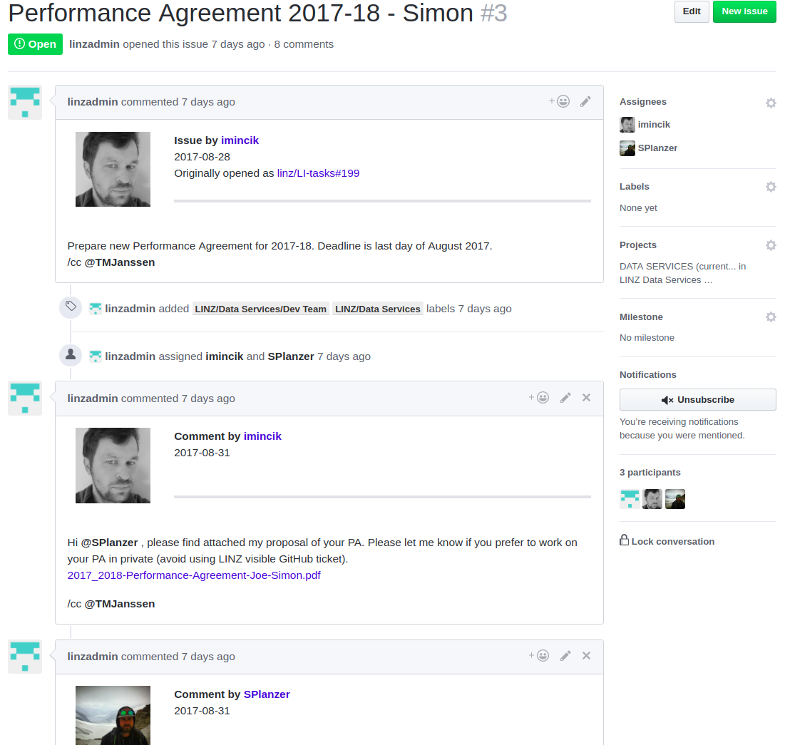

# github-issue-migrator
Copy Github Issues and comments from one repo to another

By adding the configuration parameters to the configuration .yaml the issues migration script will read all issues and comments from one repository and  write the issues to a new repository. Once the script has migrated the issues it will link the old issues to the new issue and close the old issue. 

What is migrated:
* Issues
* Comments
* Labels 
* Assignees

Not currently migrated by the script:
* Project
* Mile stones

 

## Usage

The script takes one argument. The argument being the path to the configuration file

` python migrate_issues.py <path/to/config/file>

## Config

See the below example of the utilities configuration.
* **access_token:** GitHub token. This must be generated with suitable access to repositories and users. At a minimum access to read / write the repositories the issues are being migrated to / from and read access to all user profile data. You may want to supply an access token for an admin user (as in the above example) so that all comments are associated to this user.  
* **from_owner:** The organisation / user that owns the repo to be read from 
* **from_repo:** The repository that the issues are to be read from
* **to_owner:** The organisation / user that owns the repo the issues are being written to
* **to_repo:** The repository that the issues are to be migrated to
* **issues:** The repositories issues ids that are to be migrated. 
~~~
---
Connection:
  access_token: 'abc123'

Repo: 
  from_owner: 'linz' 
  from_repo: 'li-tasks'
  to_owner: 'linz'
  to_repo: 'ds-dev-team'

Issues:
  issues: [125, 234, 123]

~~~